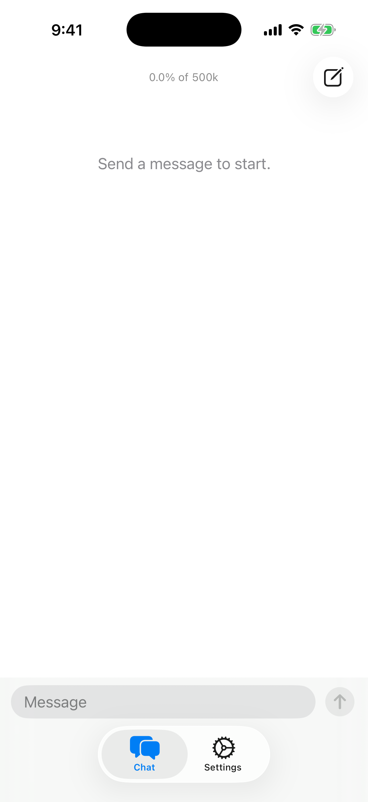
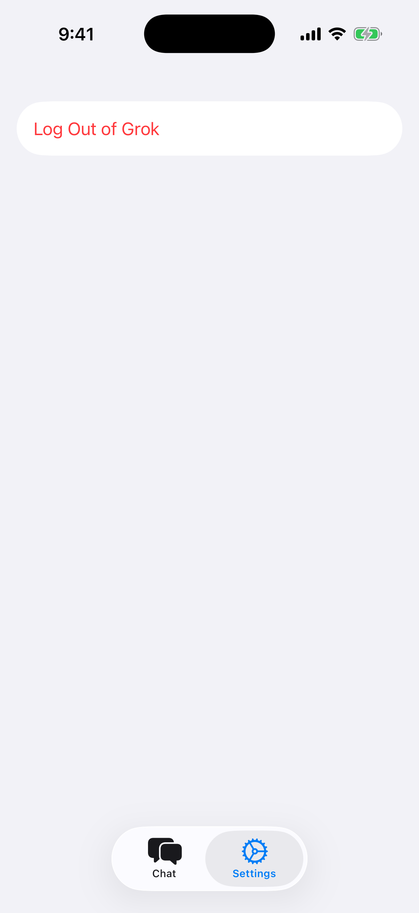

# Fun coding agent iOS

Native iPhone and iPad window for Fun coding agent. One workspace (the app container): login, chats, thread, thinking, Send Now, and the queue. Agent and tools live in Rust (`fun-core` / [fun-coding-agent-gui-core](https://github.com/swimming-bookstore/fun-coding-agent-gui-core)); SwiftUI is only the window. iOS cannot open folders; New Chat creates another session in the same container, listed from the left-side Chats menu.

<p align="center">
  
  &nbsp;
  
</p>

```
ios/           SwiftUI app + Generated bindings
```

```sh
# login still lives in the CLI
cargo install --git https://github.com/swimming-bookstore/fun-coding-agent --bin fun
fun login

open ios/Fun.xcodeproj
```

Run the `Fun` scheme (iOS 17+, Xcode, `rustup` with iOS targets). Xcode builds the shared Rust core first (`scripts/build-core.sh`) into `ios/Fun/Generated/`. Same script works from a terminal.

Uses the same config, auth, and sessions as `fun`:

- Config: `~/.config/fun/config.json`
- Auth: `~/.local/share/fun/auth.json`
- Sessions: `~/.local/share/fun/sessions/`

On a device those paths are under the app sandbox (`HOME`). Simulator builds share the host login when `HOME` matches. Log in from Settings; every chat uses the same sandbox workspace. Tap Chats on the left to switch or delete older sessions.

Depends on `fun-core` and `provider-grok` from https://github.com/swimming-bookstore/fun-coding-agent, and on https://github.com/swimming-bookstore/fun-coding-agent-gui-core (not a local checkout).

`python3 scripts/record-demo.py` writes `demo/demo.mp4` (needs `fun login`, Xcode, iOS Simulator, and a live Grok session).

## Screenshots

| Chat | Settings |
| --- | --- |
| Thread, thinking dock, Send Now, queue, and composer | Log in or out of Grok |
|  |  |
